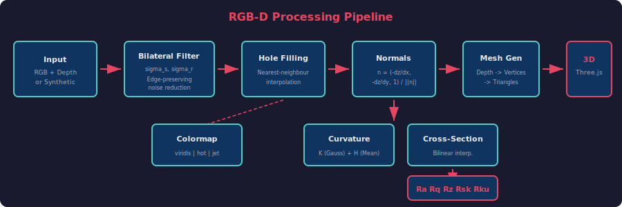
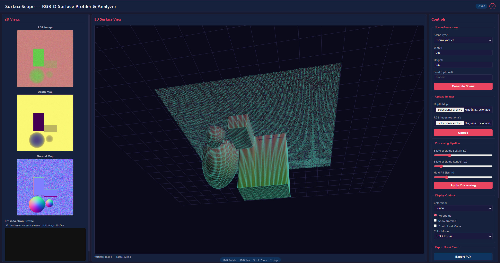
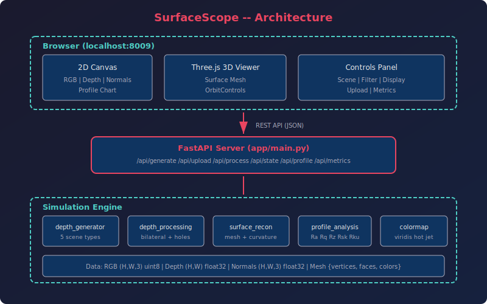

# SurfaceScope -- RGB-D Surface Profiler & Analyzer

A web-based RGB-D depth profiling application for synthetic and real depth data. SurfaceScope generates depth maps from five configurable scene types, applies edge-preserving processing pipelines (bilateral filter, hole filling), reconstructs interactive 3D surface meshes, computes differential geometry quantities (Gaussian and mean curvature), extracts cross-section profiles, and reports ISO 4287 surface roughness metrics (Ra, Rq, Rz, Rsk, Rku). Built with a Python/FastAPI backend and a Three.js-powered frontend for real-time 3D visualization.

---

## Motivation & Problem

Industrial surface inspection requires measuring roughness, curvature, and defects from depth sensor data. RGB-D cameras provide color and depth at each pixel, enabling 3D surface reconstruction and quantitative ISO 4287 characterization.



---

## KPIs & Metrics

| Metric | Target | Current |
|--------|--------|---------|
| Bilateral filter | Edge-preserving smoothing | σ_spatial=5, σ_range=10 |
| Curvature | Gaussian K + mean H | Second-order finite differences |
| Roughness ISO 4287 | Ra, Rq, Rz, Rsk, Rku | All 5 metrics implemented |
| Export formats | Standard 3D formats | PLY, PCD, OBJ |
| Test coverage | Comprehensive | 90 tests passing |

---

## Mathematical Model

### Pinhole Camera — From Pixels to 3D
An RGB-D camera provides a depth value Z at each pixel (u,v). The pinhole model recovers the 3D world coordinates by "unprojecting" through the camera's intrinsic parameters:

```
X = (u − cx) · Z / fx,    Y = (v − cy) · Z / fy
```

where **(cx, cy)** is the principal point (optical center in pixels), **(fx, fy)** are the focal lengths in pixels, and **Z** is the depth in mm. This converts every pixel with valid depth into a 3D point, forming a point cloud that can be meshed into a surface.

### Bilateral Filter — Edge-Preserving Smoothing
Depth sensors produce noisy data. Standard Gaussian blur would smear sharp edges (object boundaries). The bilateral filter preserves edges by weighting neighbors based on BOTH spatial proximity and depth similarity:

```
BF[I](p) = (1/W) · Σ_q  G_σs(‖p−q‖) · G_σr(|I(p)−I(q)|) · I(q)
```

where **G_σs** is the spatial Gaussian (nearby pixels contribute more), **G_σr** is the range Gaussian (similar-depth pixels contribute more), and **W** normalizes the weights. Pixels across a depth edge have large |I(p)−I(q)| → small G_σr → edge preserved.

### Surface Curvature — Shape Characterization
The Gaussian curvature K measures the intrinsic bending of the surface — positive for peaks/valleys, negative for saddle points, zero for flat/cylindrical regions:

```
K = (fxx · fyy − fxy²) / (1 + fx² + fy²)²
```

where **fx, fy** are first partial derivatives (slope) and **fxx, fyy, fxy** are second derivatives (curvature) of the depth map. This is computed from the Monge patch representation z=f(x,y). The denominator accounts for the surface not being aligned with the image plane.

### ISO 4287 Roughness — Quantitative Surface Quality
The arithmetic mean roughness Ra is the standard industrial metric for surface finish:

```
Ra = (1/N) · Σᵢ |zᵢ − z̄|
```

where **zᵢ** are sampled heights along a cross-section profile and **z̄** is their mean. Ra represents the average deviation from the mean line — a machined surface might have Ra=0.8μm, while a cast surface might have Ra=12μm. Higher-order metrics (Rq=RMS, Rz=peak-to-valley, Rsk=skewness, Rku=kurtosis) capture different aspects of the surface texture.

### Root-Mean-Square Roughness

```
Rq = sqrt((1/N) * Sum_i (z_i - z_bar)^2)
```

### Bilateral Filter

Edge-preserving smoothing combining spatial and range Gaussians:

```
BF[I](p) = (1/W) * Sum_q  G_sigma_s(||p - q||) * G_sigma_r(|I(p) - I(q)|) * I(q)
```

where `W` is the normalizing partition function, `G_sigma_s` is the spatial kernel, and `G_sigma_r` is the range (intensity) kernel.

### Surface Normals

Per-pixel unit normals computed from depth gradients:

```
n_hat = normalize(-dz/dx, -dz/dy, 1)
```

---

## Processing Pipeline


---

## Frontend



---

## Architecture



---

## Features

- **5 synthetic scene types**: Gaussian hills, terrain, object on table, conveyor belt, wave surface
- **Bilateral filter**: Edge-preserving depth smoothing with configurable spatial and range sigma
- **Hole filling**: Nearest-neighbour interpolation for invalid pixels with configurable maximum hole size
- **Surface normals**: Per-pixel unit normals via finite-difference gradients (numpy.gradient)
- **3D mesh generation**: Vectorised depth-to-triangle-mesh conversion for Three.js BufferGeometry
- **Surface curvature**: Gaussian curvature K and mean curvature H from second-order depth derivatives
- **Cross-section profiles**: Bilinear-interpolated 1D height profiles along arbitrary user-drawn lines
- **Roughness metrics**: ISO 4287 parameters -- Ra, Rq, Rz, Rsk, Rku
- **Object detection**: Depth-thresholding with connected-component labelling for raised objects
- **Interactive 3D viewer**: Three.js r128 with OrbitControls, wireframe overlay, point cloud mode
- **Surface area measurement**: Vectorised 3D triangle-area computation over the depth map
- **Image upload**: Support for user-provided depth + RGB image pairs (8-bit and 16-bit PNG)
- **Export**: PLY (ASCII), PCD (ASCII), and Wavefront OBJ mesh export
- **Colourmap rendering**: Hot, Viridis, Jet, and Greyscale depth visualisation
- **Help modal**: In-app documentation with keyboard/mouse controls and pipeline explanation

---

## Quick Start

```bash
cd "d:/_Repos/_SCIENCE/FASL_3D_Distance_Profiler"
python -m venv .venv
source .venv/Scripts/activate   # Windows Git Bash
pip install -r requirements.txt
python run_app.py
```

Open **http://localhost:8009** in your browser.

### Running Tests

```bash
python tests/test_depth_processing.py
python tests/test_surface.py
python tests/test_profile.py
```

### Building with PyInstaller

```powershell
.\Build_PyInstaller.ps1
```

---

## Project Structure

```
FASL_3D_Distance_Profiler/
├── app/
│   ├── __init__.py
│   ├── main.py                     # FastAPI application entry point
│   ├── api/
│   │   ├── __init__.py
│   │   └── routes.py               # REST API endpoints (generate, upload, process, profile, metrics, export, measure)
│   ├── simulation/
│   │   ├── __init__.py
│   │   ├── colormap.py             # Depth-to-colour mapping (hot, viridis, jet, greyscale)
│   │   ├── depth_generator.py      # Synthetic RGB-D scene generator (5 scene types)
│   │   ├── depth_processing.py     # Bilateral filter, hole filling, normals, point cloud projection
│   │   ├── export.py               # PLY, PCD, OBJ file export
│   │   ├── profile_analysis.py     # Roughness metrics (Ra, Rq, Rz, Rsk, Rku), histogram, object detection
│   │   └── surface_reconstruction.py # Depth-to-mesh, curvature, cross-section extraction
│   └── static/
│       ├── index.html              # Single-page application frontend
│       ├── css/
│       │   └── style.css           # Dark-theme 3-panel layout stylesheet
│       └── js/
│           ├── app.js              # Main controller: wires UI to API
│           ├── renderer2d.js       # 2D canvas rendering + cross-section tool
│           └── renderer3d.js       # Three.js 3D surface renderer
├── tests/
│   ├── __init__.py
│   ├── test_depth_processing.py    # Bilateral filter, hole filling, normals, point cloud tests
│   ├── test_export.py              # PLY, PCD, OBJ export tests
│   ├── test_measurement.py         # Distance, angle, area measurement tests
│   ├── test_profile.py             # Roughness, histogram, object detection tests
│   └── test_surface.py             # Mesh generation, curvature, cross-section tests
├── docs/
│   ├── architecture.md             # System architecture and component diagram
│   ├── depth_theory.md             # RGB-D depth processing theory with equations
│   ├── development_history.md      # Changelog with mathematical foundations
│   ├── references.md               # Academic papers, standards, and library references
│   └── svg/
│       ├── architecture.svg        # Architecture diagram
│       └── pipeline.svg            # Processing pipeline diagram
├── build.spec                      # PyInstaller spec file
├── Build_PyInstaller.ps1           # PowerShell build script
├── run_app.py                      # Uvicorn launcher with auto-browser
├── requirements.txt                # Python dependencies
└── __init__.py
```

---

## API Documentation

| Method | Path               | Description                                         |
|--------|--------------------|-----------------------------------------------------|
| POST   | `/api/generate`    | Generate a synthetic RGB-D scene                    |
| POST   | `/api/upload`      | Upload depth map + optional RGB image               |
| POST   | `/api/process`     | Apply bilateral filter + hole filling pipeline      |
| GET    | `/api/state`       | Get current state (base64 images + mesh JSON)       |
| POST   | `/api/profile`     | Extract cross-section profile between two points    |
| GET    | `/api/metrics`     | Compute depth histogram, curvature, object detection|
| POST   | `/api/measure`     | Measure distance, angle, or surface area            |
| GET    | `/api/export/ply`  | Download point cloud / mesh as PLY (ASCII)          |
| GET    | `/api/export/pcd`  | Download point cloud as PCD (ASCII)                 |
| GET    | `/api/export/obj`  | Download mesh as Wavefront OBJ                      |
| GET    | `/api/scene_types` | List available synthetic scene types                |
| GET    | `/api/colormaps`   | List available colourmap names                      |
| GET    | `/health`          | Health check endpoint                               |

---

## Port

**8009** -- http://localhost:8009

---

## Documentation

- [Architecture](docs/architecture.md) -- System overview, technology stack, data flow
- [Depth Theory](docs/depth_theory.md) -- Mathematical foundations: pinhole model, bilateral filter, curvature, roughness
- [Development History](docs/development_history.md) -- Changelog with equations
- [References](docs/references.md) -- Academic papers, standards, hardware, and software references

---

## References

- Tomasi, C. & Manduchi, R. (1998). Bilateral Filtering for Gray and Color Images. ICCV.
- ISO 4287:1997. GPS -- Surface texture: Profile method.
- do Carmo, M. P. (1976). Differential Geometry of Curves and Surfaces.
- Hartley, R. & Zisserman, A. (2003). Multiple View Geometry in Computer Vision.
- Three.js -- JavaScript 3D library: https://threejs.org/
